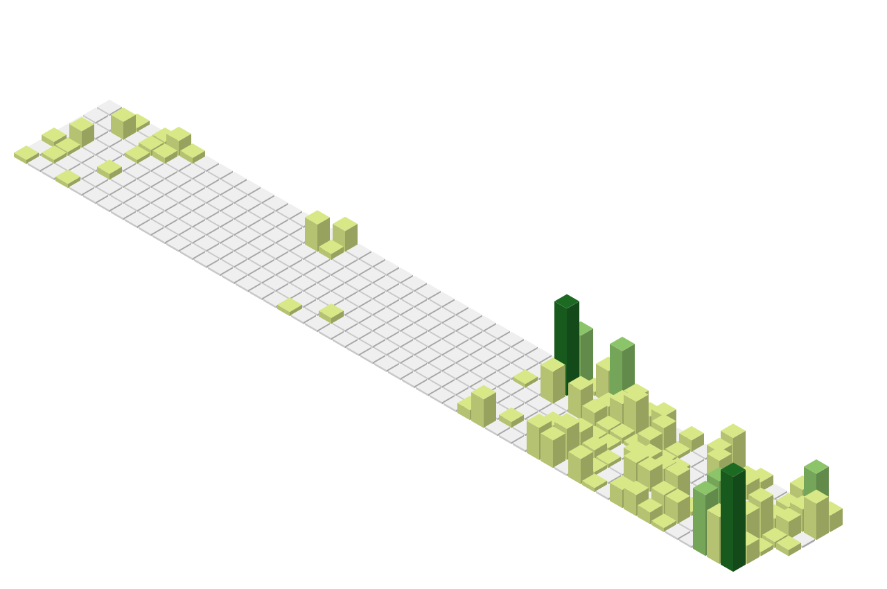

  

  I build PHP and JavaScript systems that connect business workflows, data, and third-party services.

  
  
  

## Stack

  

## Activity

<picture>
  <source media="(prefers-color-scheme: dark)" srcset="profile-3d-contrib/profile-3d-dark.svg">
  
</picture>

  <picture>
    <source media="(prefers-color-scheme: dark)" srcset="https://streak-stats.demolab.com?user=jdiffy47&mode=weekly&hide_border=true&background=00000000&ring=fb923c&fire=fb923c&currStreakLabel=fb923c&currStreakNum=f0f6fc&sideNums=f0f6fc&sideLabels=9198a1&dates=9198a1">
    
  </picture>

<picture>
  <source media="(prefers-color-scheme: dark)" srcset="https://raw.githubusercontent.com/jdiffy47/jdiffy47/output/github-contribution-grid-snake-dark.svg">
  
</picture>

